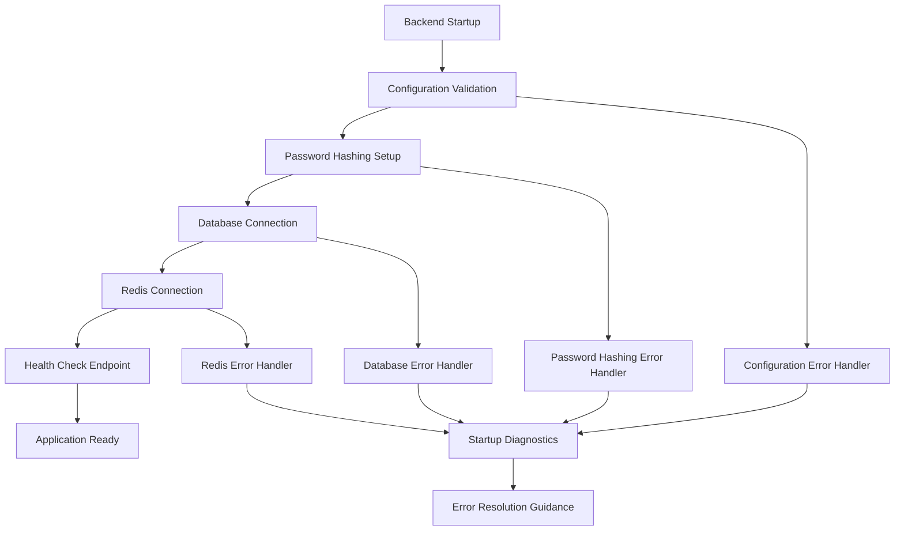

# Design Document

## Overview

This design addresses critical backend startup failures in the Flashfood Tracker FastAPI application. The primary issues are bcrypt/passlib initialization errors and Pydantic Settings CORS configuration parsing failures. The solution implements robust password hashing with proper error handling, flexible CORS configuration parsing, comprehensive startup validation, and enhanced diagnostics.

The design follows current best practices for FastAPI applications, uses compatible library versions, and provides clear error messages to facilitate rapid troubleshooting during development and deployment.

## Architecture

### Current Architecture Issues

The current backend startup process has several failure points:

1. **Password Hashing Initialization**: The `passlib.context.CryptContext` fails during module import due to bcrypt version compatibility issues
2. **Configuration Parsing**: Pydantic Settings cannot parse `BACKEND_CORS_ORIGINS` as a list from environment variables
3. **Error Handling**: Startup failures provide cryptic error messages without resolution guidance
4. **Dependency Validation**: No validation that critical services (database, Redis) are accessible during startup

### Proposed Architecture



The new architecture implements:
- **Staged Initialization**: Each component initializes in sequence with proper error handling
- **Configuration Validation**: Comprehensive validation of all environment variables before use
- **Error Recovery**: Graceful degradation and clear error messages for each failure mode
- **Startup Diagnostics**: Detailed health checks for all critical dependencies

## Components and Interfaces

### 1. Configuration Management (`app/core/config.py`)

**Enhanced Settings Class**:
```python
class Settings(BaseSettings):
    # Existing fields...
    
    # Enhanced CORS handling with custom validator
    BACKEND_CORS_ORIGINS: List[str] = Field(default_factory=list)
    
    @field_validator('BACKEND_CORS_ORIGINS', mode='before')
    @classmethod
    def parse_cors_origins(cls, v):
        """Parse CORS origins from various formats"""
        # Implementation handles JSON, CSV, and list formats
        
    @model_validator(mode='after')
    def validate_configuration(self):
        """Validate complete configuration after parsing"""
        # Implementation validates all critical settings
```

**CORS Parsing Strategy**:
Based on Pydantic Settings documentation, the solution supports multiple input formats:
- JSON format: `'["http://localhost:5173","http://localhost:3000"]'`
- CSV format: `'http://localhost:5173,http://localhost:3000'`
- Space-separated: `'http://localhost:5173 http://localhost:3000'`
- Single value: `'http://localhost:5173'`

### 2. Password Hashing System (`app/core/security.py`)

**Robust Password Context**:
```python
class PasswordHasher:
    def __init__(self):
        """Initialize with fallback strategies"""
        self._context = self._create_password_context()
    
    def _create_password_context(self) -> CryptContext:
        """Create password context with version compatibility handling"""
        # Implementation tries multiple bcrypt configurations
        
    def hash_password(self, password: str) -> str:
        """Hash password with length validation"""
        # Implementation validates 72-byte limit
        
    def verify_password(self, plain: str, hashed: str) -> bool:
        """Verify password with error handling"""
        # Implementation handles verification errors gracefully
```

**bcrypt Compatibility Strategy**:
Research shows the issue is related to bcrypt 4.0+ changes. The solution:
1. **Primary**: Use `bcrypt==4.0.1` with explicit configuration
2. **Fallback**: Downgrade to `bcrypt==3.2.0` if needed
3. **Alternative**: Switch to Argon2 for better security and compatibility

### 3. Startup Validation (`app/core/startup.py`)

**Startup Validator**:
```python
class StartupValidator:
    def __init__(self, settings: Settings):
        self.settings = settings
        self.errors: List[str] = []
        
    async def validate_all(self) -> bool:
        """Run all startup validations"""
        # Implementation checks all critical components
        
    async def validate_database(self) -> bool:
        """Validate database connectivity"""
        # Implementation tests PostgreSQL connection
        
    async def validate_redis(self) -> bool:
        """Validate Redis connectivity"""
        # Implementation tests Redis connection
        
    def generate_diagnostics(self) -> Dict[str, Any]:
        """Generate comprehensive diagnostic report"""
        # Implementation provides detailed system status
```

### 4. Error Handling and Diagnostics (`app/core/diagnostics.py`)

**Diagnostic System**:
```python
class DiagnosticReporter:
    def generate_startup_report(self) -> Dict[str, Any]:
        """Generate comprehensive startup diagnostic report"""
        # Implementation provides system status, versions, connectivity
        
    def suggest_resolutions(self, error_type: str, error_details: str) -> List[str]:
        """Provide specific resolution suggestions for common errors"""
        # Implementation maps errors to actionable solutions
```

## Data Models

### Configuration Models

```python
@dataclass
class StartupStatus:
    component: str
    status: Literal["success", "warning", "error"]
    message: str
    details: Optional[Dict[str, Any]] = None
    resolution_steps: Optional[List[str]] = None

@dataclass
class DiagnosticReport:
    timestamp: datetime
    overall_status: Literal["healthy", "degraded", "failed"]
    components: List[StartupStatus]
    environment_info: Dict[str, str]
    recommendations: List[str]
```

### Error Response Models

```python
class StartupError(BaseModel):
    error_type: str
    component: str
    message: str
    details: Dict[str, Any]
    resolution_steps: List[str]
    documentation_links: List[str]
```

## Correctness Properties

*A property is a characteristic or behavior that should hold true across all valid executions of a system-essentially, a formal statement about what the system should do. Properties serve as the bridge between human-readable specifications and machine-verifiable correctness guarantees.*

### Property 1: Password Hashing Round Trip
*For any* valid password (up to 72 bytes), hashing then verifying should return True for the original password and False for any different password
**Validates: Requirements 1.2, 1.3, 1.5**

### Property 2: Password Context Initialization
*For any* valid environment configuration, the password hashing context should initialize successfully without errors
**Validates: Requirements 1.1**

### Property 3: Configuration Parsing Consistency  
*For any* valid CORS origins specification (JSON, CSV, or space-separated format), parsing should produce the same list of origins regardless of input format
**Validates: Requirements 2.2**

### Property 4: Configuration Validation Completeness
*For any* environment variable configuration, all required variables should be validated and missing variables should trigger appropriate error messages with resolution guidance
**Validates: Requirements 2.1, 2.4, 2.5, 5.1**

### Property 5: Dependency Validation
*For any* system state, startup validation should correctly identify the status of all critical dependencies (database, Redis) and report their connectivity
**Validates: Requirements 3.4**

### Property 6: Error Message Quality
*For any* startup error condition, the error message should contain sufficient context for debugging and specific resolution steps
**Validates: Requirements 4.1, 4.4**

### Property 7: Security Configuration Validation
*For any* production environment configuration, insecure settings should be identified and secure alternatives should be suggested
**Validates: Requirements 5.2, 5.5**

### Property 8: Graceful Degradation
*For any* optional dependency failure, the system should continue startup without crashing and log appropriate warnings
**Validates: Requirements 3.5**

<function_calls>
<invoke name="prework">
<parameter name="featureName">backend-startup-fixes

## Error Handling

### Error Categories

1. **Configuration Errors**
   - Missing required environment variables
   - Invalid CORS format
   - Malformed database URLs
   - Weak or missing SECRET_KEY

2. **Dependency Errors**
   - Database connection failures
   - Redis connection failures
   - bcrypt initialization failures

3. **Security Warnings**
   - Insecure production settings
   - Weak authentication configuration
   - Missing security headers

### Error Response Strategy

Each error category provides:
- **Clear Error Message**: Human-readable description of the issue
- **Error Context**: Specific details about what failed and why
- **Resolution Steps**: Actionable steps to fix the issue
- **Documentation Links**: References to relevant documentation
- **Example Configuration**: Working examples when applicable

### Logging Strategy

```python
# Structured logging for better debugging
logger.error(
    "Configuration validation failed",
    extra={
        "component": "config_parser",
        "error_type": "cors_parsing_error",
        "variable": "BACKEND_CORS_ORIGINS",
        "provided_value": cors_value,
        "expected_formats": ["JSON array", "CSV string", "space-separated"],
        "resolution_steps": [
            "Use JSON format: '[\"http://localhost:5173\"]'",
            "Use CSV format: 'http://localhost:5173,http://localhost:3000'",
            "Check for extra quotes or escape characters"
        ]
    }
)
```

## Testing Strategy

### Unit Testing Approach

**Configuration Testing**:
- Test CORS parsing with various input formats (JSON, CSV, space-separated)
- Test environment variable validation with missing/invalid values
- Test default value assignment for optional variables
- Test security validation in different environments (dev/prod)

**Password Hashing Testing**:
- Test bcrypt context initialization with different library versions
- Test password hashing with various input lengths (including 72-byte limit)
- Test password verification with correct and incorrect passwords
- Test error handling for bcrypt initialization failures

**Startup Validation Testing**:
- Test database connectivity validation with various connection states
- Test Redis connectivity validation with various connection states
- Test graceful degradation when optional services are unavailable
- Test diagnostic report generation with different system states

### Property-Based Testing Approach

**Property Test Configuration**:
- Use `hypothesis` library for Python property-based testing
- Minimum 100 iterations per property test
- Each test tagged with feature and property reference
- Custom generators for realistic test data

**Password Hashing Properties**:
- Generate random passwords (respecting 72-byte limit)
- Test round-trip consistency (hash → verify)
- Test hash uniqueness (same password produces different hashes due to salt)
- Test verification correctness (correct password = True, incorrect = False)

**Configuration Properties**:
- Generate various CORS format combinations
- Test parsing consistency across formats
- Generate environment variable combinations
- Test validation completeness and error message quality

**Error Handling Properties**:
- Generate various error conditions
- Test error message structure and content
- Test resolution step generation
- Test logging format consistency

### Integration Testing

**Startup Sequence Testing**:
- Test complete startup process with valid configuration
- Test startup failure scenarios with invalid configuration
- Test health check endpoint after successful startup
- Test diagnostic endpoint with various system states

**Docker Environment Testing**:
- Test startup in Docker container environment
- Test environment variable parsing in containerized environment
- Test volume mounting for configuration files
- Test network connectivity to external services

### Test Data Generators

```python
# Custom generators for realistic test data
@composite
def valid_cors_origins(draw):
    """Generate valid CORS origin lists in various formats"""
    origins = draw(lists(urls(), min_size=1, max_size=5))
    format_choice = draw(sampled_from(['json', 'csv', 'space']))
    # Return formatted string based on choice

@composite  
def valid_passwords(draw):
    """Generate valid passwords within bcrypt limits"""
    # Generate passwords up to 72 bytes, various character sets
    
@composite
def environment_configs(draw):
    """Generate realistic environment variable configurations"""
    # Generate combinations of required/optional variables
```

This comprehensive testing strategy ensures all correctness properties are validated through both specific examples (unit tests) and universal properties (property-based tests), providing confidence that the backend startup fixes work reliably across all scenarios.